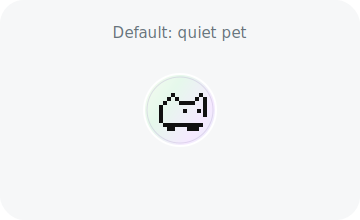
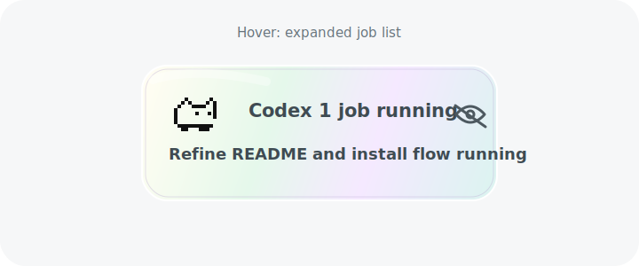

# Codex Pet

A tiny macOS desktop pet for watching Codex Desktop jobs without keeping the
Codex window in focus.

By default Codex Pet sits on your desktop as a small draggable cat. Hover it to
expand a glass panel with the current Codex job count and per-conversation
running tasks.

<p align="center">
  
  
</p>

## Features

- Quiet collapsed mode: just a circular pixel cat.
- Hover-to-expand job list for active Codex conversations.
- Real Codex state from hook events, not a guessed timer.
- Per-session tracking when multiple Codex conversations are running.
- Draggable floating window with saved position.
- Local-only: no telemetry and no network requests.

Codex Pet shows:

- `idle`: Codex Desktop is open and no job is active.
- `running`: Codex is thinking, using tools, compacting, waiting, or asking for permission.
- `done`: the latest turn just completed.
- `closed`: Codex Desktop is not running.

## Quick Start

Requirements:

- macOS 13 or newer
- Codex Desktop
- Swift 5.9 or newer, usually from Xcode Command Line Tools
- Node.js for the Codex hook installer

Clone and start:

```sh
git clone https://github.com/fzx2666-fz/codex-pet.git
cd codex-pet
./scripts/install-and-start.sh
```

The script will:

1. Build `dist/CodexPet.app`.
2. Install or repair Codex hooks in `~/.codex/hooks.json`.
3. Start Codex Pet.

After the first install, start a new Codex prompt so the hooks can write fresh
state. Hover the cat to expand the job list.

## Daily Use

Start the app:

```sh
open dist/CodexPet.app
```

Repair hooks after moving the repository or rebuilding:

```sh
node dist/CodexPet.app/Contents/Resources/install-codex-statusbar.js --app-path dist/CodexPet.app
```

Remove Codex Pet hooks:

```sh
node dist/CodexPet.app/Contents/Resources/uninstall-codex-statusbar.js
```

Quit Codex Pet from the macOS menu bar item, or use Activity Monitor.

## How It Works

Codex Pet reads per-session hook state files written by Codex hook events:

```text
~/.codex/statusbar/state.d/<session_id>.json
```

Each file maps to one Codex session, which lets the floating panel list running
conversations independently. If hook files are unavailable, the app falls back
to the local Codex runtime log database:

```text
~/.codex/logs_2.sqlite
```

The installer updates `~/.codex/hooks.json` and creates a one-time backup:

```text
~/.codex/hooks.json.bak-codex-pet
```

## Troubleshooting

**The cat stays idle while Codex is working.**

Run the hook installer again, then start a new Codex prompt:

```sh
node dist/CodexPet.app/Contents/Resources/install-codex-statusbar.js --app-path dist/CodexPet.app
```

**The app says `closed`.**

Open Codex Desktop. `closed` means Codex Pet cannot find the Codex Desktop
process.

**The app opens twice.**

Quit all existing instances, then open one app:

```sh
pkill -x CodexPet
open dist/CodexPet.app
```

**You moved the app or repository.**

Run `./scripts/install-and-start.sh` again so hooks point at the new app path.

## Development

Build only:

```sh
./scripts/build-release.sh
```

Build outputs are written to:

```text
dist/CodexPet.app
dist/codex-status
```

Optional custom paths:

```sh
CODEX_STATUSBAR_STATE_DIR=/path/to/state.d open dist/CodexPet.app
CODEX_LOG_DB=/path/to/logs_2.sqlite open dist/CodexPet.app
```

## Privacy

Codex Pet is local-only. It does not send telemetry or make network requests.
It reads local Codex hook state files and, as a fallback, local Codex runtime
logs. See `PRIVACY.md` for details.

## Repository Layout

```text
scripts/                     User-facing install/start helpers
scripts/codex-hooks/         Codex hook installer and writer scripts
work/codex-statusbar/        Swift package and source code
work/codex-statusbar/third_party
                              Third-party license notices
docs/screenshots/            README screenshots
dist/                        Generated local build output, ignored by git
```

## Third-party Code

The bundled hook writer scripts are based on
[PG408/codex-status-bar](https://github.com/PG408/codex-status-bar). Its MIT
license and notices are preserved under `work/codex-statusbar/third_party/`.

The bundled pixel cat sprite is `oneko.gif` from
[adryd325/oneko.js](https://github.com/adryd325/oneko.js). Its MIT license is
preserved under `work/codex-statusbar/third_party/oneko.js/`.

## License

MIT. See `LICENSE` and `NOTICE`.
